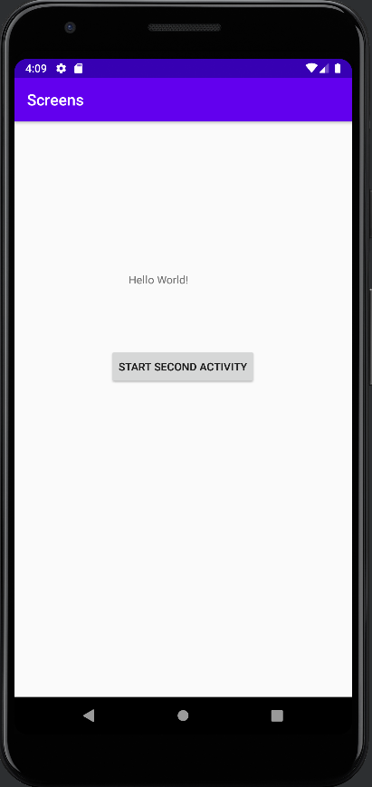
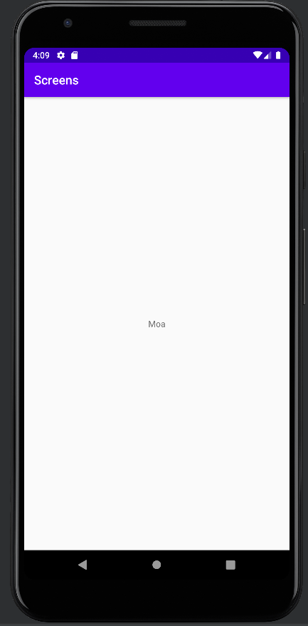

# Rapport

**Skriv din rapport här!**


## Följande grundsyn gäller dugga-svar:

- Jag har skapat en second activity med hjälpt av File->new->Activity->Empty Activity
- Jag har skapat en button i mainActivity xml. Trycka att visa secondactivity page. I mainactivity.
- Jag har add data med hjälp av putExtra.
- Den data kommer visas ut i secondActivity när jag klicka på knappen.

```
<Button
        android:id="@+id/start_second_activity" //Skapat id till button//
        android:layout_width="wrap_content"
        android:layout_height="wrap_content"
        android:text="Start second activity" //Text i button//
       .../>
        
 super.onCreate(savedInstanceState);
 setContentView(R.layout.activity_main); //I activity main//
 Button button=findViewById(R.id.start_second_activity); //Hitta buttons id//
 button.setOnClickListener(new View.OnClickListener() {
         @Override
         public void onClick(View view) {
         Intent intent= new Intent(MainActivity.this,SecondActivity.class); //när man klicka på knappen, kommer till sidan secondActivity//
         startActivity(intent);//Starta köra//
         
 intent.putExtra("name","Moa"); //Add data//     
 
 setContentView(R.layout.activity_second);//sätta view i activity_second//
 TextView textView=findViewById(R.id.name);//hitta id:name//
 Bundle extras = getIntent().getExtras();
        if (extras != null) {   //Om det finns text//
            String name= extras.getString("name");
            textView.setText(name);
        }         
```





